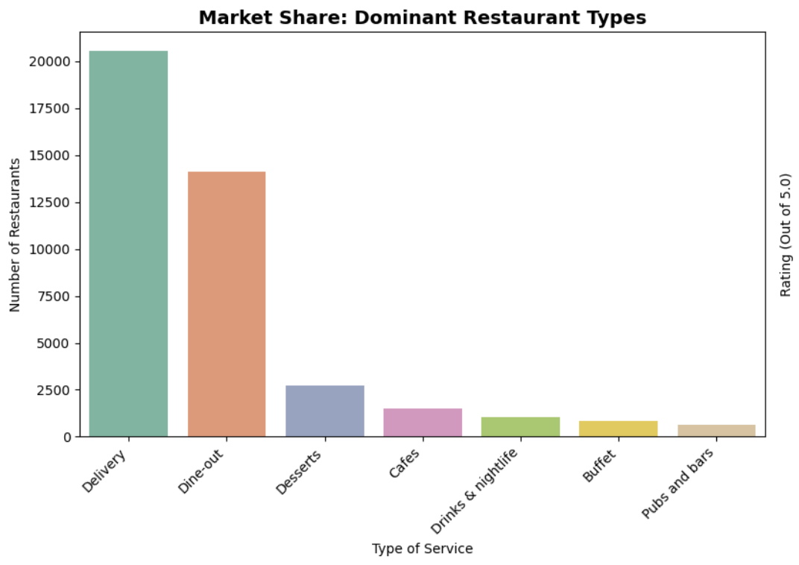
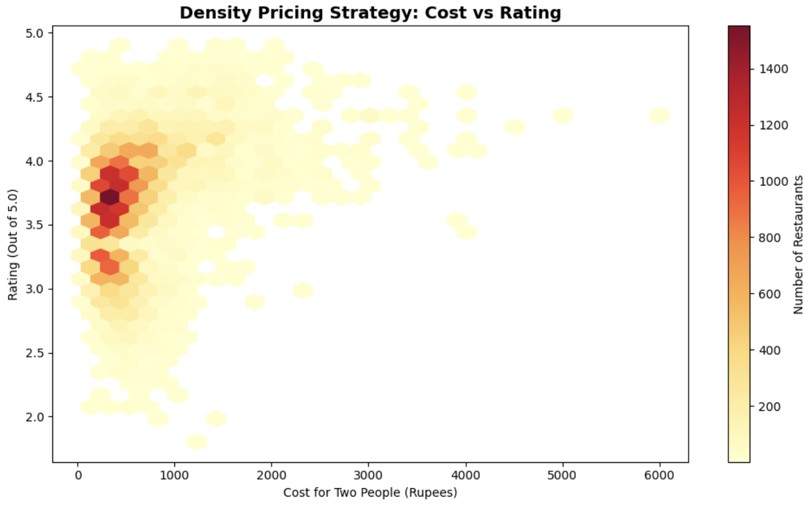
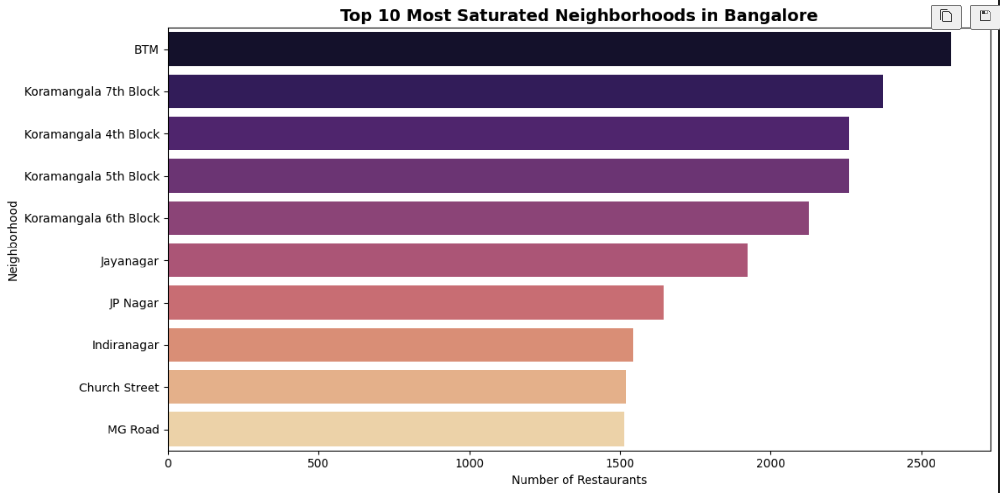
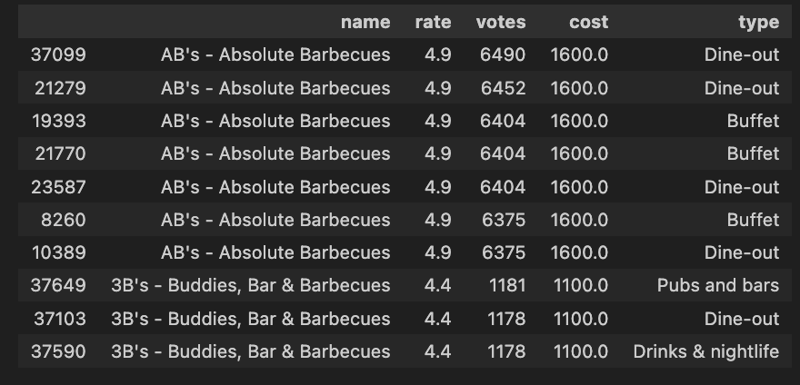

# 🍛 Zomato Business EDA – Bangalore Restaurant Insights

[

## 📌 What’s this?
I wanted to practice exploratory data analysis on a real-world business dataset, so I picked Zomato’s Bangalore restaurant data. The goal was to clean messy real-world data, then dig out insights that could actually help someone make decisions — like where to open a new premium restaurant, how pricing affects ratings, and which restaurant types dominate the market.

## 🧹 The Data Pipeline
1. **Rate Column Cleanup** >    The `rate` column was a mess — values like `4.1/5`, `NEW`, `-`, and empty strings all mixed together. I stripped the `/5` suffix, converted to numeric, and treated `NEW` and `-` as missing. This was by far the most annoying part.

2. **Missing Values & Cost Conversion** >    Dropped rows with no rating (about 7k+). For `approx_cost(for two people)`, removed commas and converted to float so it could be used in analysis.

3. **Feature Engineering** >    Created a few extra columns like `listed_in(type)` split, and extracted the broad restaurant type for market share.

4. **Geospatial Grouping** >    Grouped by `location` (neighbourhood) to find saturated areas and then filtered for premium restaurants inside the most crowded locality.

## 📊 Key Insights & Screenshots

### 1. Market Share: Who dominates?

> Delivery and Dine-out absolutely dominate the market. If you're planning to open a new place, these two formats are the safest bets — but also the most competitive.

### 2. Pricing Strategy: Cost vs Rating

> There's a clear pattern: as the cost for two people goes up, the rating floor also rises. Cheap places can be hit or miss, but expensive restaurants almost never have truly terrible ratings. If you're charging a premium, you *have* to deliver on quality.

### 3. Geospatial Saturation: Top 10 Neighbourhoods

> BTM Layout has far more listed restaurants than any other locality. That means massive competition, but also huge footfall. The next few spots — Koramangala, HSR, JP Nagar — are also packed. An investor should look at these areas with caution unless they have a unique offering.

### 4. Competitor Analysis: Premium Spots in BTM

> After zooming into BTM and filtering for premium dining (cost > 1000), I pulled the actual top 10 restaurants. This is the kind of output you'd hand to a business stakeholder — it lists names, ratings, and cost, so they can immediately see who they're up against.

## 🚀 How to Run This Locally
1. Clone the repo  
   `git clone https://github.com/Rehanku/zomato-business-eda.git`  
   `cd zomato-business-eda`
2. Create a virtual environment (I used `venv`)  
   `python -m venv venv`  
   `source venv/bin/activate`
3. Install dependencies  
   `pip install pandas matplotlib seaborn`
4. Open `zomato_analysis.ipynb` in VS Code (with Jupyter extension) or JupyterLab and run all cells.

> **Note:** The screenshots above are in the `screenshots/` folder. You'll need to save your own plot images there if you want them to display (or remove the image lines if you're running everything from scratch).

## 📁 Dataset
[Zomato Bangalore Restaurants](https://www.kaggle.com/datasets/rajeshrampure/zomato-dataset) on Kaggle. Thanks to Rajesh Rampure for making it available.

## 🧠 What I Learned
- Cleaning real-world rating data is 90% of the work.
- Grouping and filtering at the neighbourhood level turns raw data into an actual competitive landscape.
- A clean DataFrame output can be just as powerful as a fancy chart when you're presenting to a non-technical audience.
